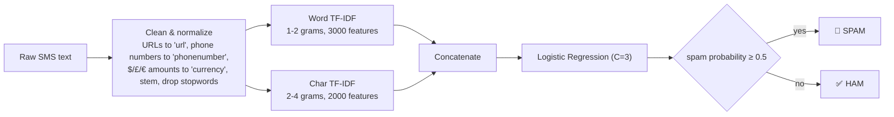

# 📱 SMS Spam Classifier

A spam/ham classifier for SMS messages that goes beyond the standard tutorial recipe: token-normalized text cleaning, hybrid word + character TF-IDF features, and a model-selection process that explicitly optimizes for the metric that actually matters in a spam filter — **precision**, not accuracy.


<!-- Once deployed, replace the URL below and uncomment:
[](https://your-app-name.streamlit.app)
-->

## Why precision, not accuracy

In a spam filter, the two error types aren't equally bad. A **false positive** — a real message (an OTP, a job offer, a message from a friend) wrongly buried in spam — is usually more costly than a **false negative**, a spam message that just sits in the inbox. Every modeling decision in this project, from the cross-validation scoring metric to the final model choice, is made with that asymmetry in mind.

## Results

Evaluated on a held-out 20% test split (1,034 messages: 903 ham, 131 spam), never touched during model selection:

| Model | Accuracy | Precision | Recall | Ham wrongly flagged as spam |
|---|---|---|---|---|
| Baseline (unigram TF-IDF + plain Naive Bayes — the "standard tutorial" recipe) | 97.87% | 100.00% | 83.21% | 0 / 903 |
| Earlier iteration (hybrid TF-IDF + Logistic Regression, `class_weight='balanced'`) — rejected | 98.74% | 94.03% | 96.18% | 8 / 903 |
| **This project** (hybrid TF-IDF + Logistic Regression, unweighted) | **98.94%** | **100.00%** | **91.60%** | **0 / 903** |

The middle row looks competitive on accuracy alone, which is exactly why accuracy is the wrong metric to optimize here: `class_weight='balanced'` pushes recall up by letting precision slip, doubling the false-positive rate. The final model matches the baseline's zero false positives while catching 11 more spam messages out of 131 (recall 83.2% → 91.6%). Full methodology, the 16-candidate comparison, and the precision/recall threshold check are in `sms-spam-detection.ipynb`.

## How it works



Two ideas worth calling out:

- **URLs, phone numbers, and currency amounts become placeholder tokens instead of being deleted.** Their presence is a strong spam signal even when the exact number isn't — "claim your prize, call **phonenumber**" generalizes across thousands of different actual phone numbers.
- **Character n-grams sit alongside word n-grams.** Stemming normalizes "winning"→"win", but it can't fix `"W1N"` or `"fr33"`. Character-level features pick up on that kind of obfuscation that word-level features and stemming miss entirely.

The whole thing — cleaning, both vectorizers, and the classifier — is one `sklearn.Pipeline`, saved as a single `pipeline.joblib`. There's no separate preprocessing code path for training vs. inference to keep in sync, and the Streamlit app loads that file directly instead of retraining on every startup.

## Project structure

```
SMS_Spam_Classifier/
├── README.md
├── requirements.txt
├── preprocessing.py            # text cleaning + pipeline builder — single source of truth,
│                                #   imported by train.py, app.py, and the notebook
├── train.py                    # trains the model, evaluates on a held-out split, saves the artifact
├── app.py                      # Streamlit demo — loads pipeline.joblib, does NOT retrain
├── sms-spam-detection.ipynb    # EDA, model comparison (16 candidates), threshold tuning
├── spam.csv                    # dataset (SMS Spam Collection, 5,572 messages)
├── pipeline.joblib             # generated by train.py — the deployable model
├── metrics.json                # generated by train.py — held-out test metrics
├── Procfile, setup.sh          # optional: buildpack-style hosts (Heroku/Render); not needed for Streamlit Cloud
├── nltk.txt                    # corpus hint for hosts that read it
├── .gitignore
└── .gitattributes
```

## Getting started

**1. Clone and install dependencies**

```bash
git clone https://github.com/nihal00753/SMS_Spam_Classifier.git
cd SMS_Spam_Classifier
python -m venv venv
source venv/bin/activate          # Windows: venv\Scripts\activate
pip install -r requirements.txt
```

**2. Train the model**

```bash
python train.py
```

This loads `spam.csv`, evaluates on an 80/20 held-out split (printing accuracy/precision/recall/F1 to the terminal), then refits on the full dataset and saves `pipeline.joblib` + `metrics.json`. You should see the same numbers as the table above — the train/test split and every model's `random_state` are fixed, so this is fully reproducible.

**3. Run the app**

```bash
streamlit run app.py
```

Opens at `http://localhost:8501`. Paste in a message, hit Predict, and it'll show the spam/ham call, a confidence score, the cleaned/stemmed text the model actually saw, and (in an expander) the held-out metrics from step 2.

**4. (Optional) Explore the notebook**

```bash
pip install jupyter
jupyter notebook sms-spam-detection.ipynb
```

Walks through the EDA, the full 16-candidate model/feature comparison with charts, the precision-recall threshold check, and a side-by-side rerun of the original baseline recipe for comparison — everything summarized in the Results table above, but with the actual cross-validation numbers and plots behind it.

### Deploying

For [Streamlit Community Cloud](https://share.streamlit.io): push this repo (including the generated `pipeline.joblib` and `metrics.json` — they're ~215 KB, no Git LFS needed) and point a new app at `app.py`. `Procfile` / `setup.sh` are only relevant for Heroku/Render-style buildpack hosts.

## Possible extensions

- Probability calibration (`CalibratedClassifierCV`) if the raw probabilities need to be more trustworthy as actual percentages, not just a ranking signal.
- A small FastAPI wrapper around `pipeline.joblib` for a proper inference API instead of (or alongside) the Streamlit UI.
- Periodic retraining as new labeled messages come in, with the same held-out evaluation gate before any new model replaces the deployed one.

## License

MIT — see [LICENSE](LICENSE).